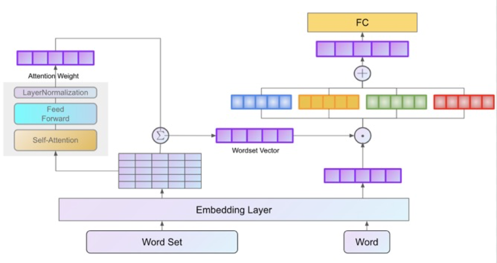

# SynSetMineOnAttention
For the problem defined in Paper [Mining Entity Synonyms with Efficient Neural Set Generation](https://arxiv.org/pdf/1811.07032.pdf), I think self-attention structure is very suitable for it. So I combine attention with DSSM structure and test it on the dataset proposed on Paper.


### Structure



From the figure we can see I use a self-attention unit to calculate a  weight of each word in word set. And we weighed average the whole word embeddings of one word set as the feature embedding of word set.  Now, we get a embedding of wordSet and a embedding of waiting word. 

We set a Mapper unit which is a full-connected neural network, through which the two embedding can become a high-dimensional feature vectors. Mapper unit can increase the diversity of representations of embeddings. 

For these two high-dimensional embeddings, we concatenate the sum, dot product, difference of them as the final feature vector. And input the final feature vector into a full-connected neural network. Finally we get the result of this Binary - Classifier.


### Experiment Setting

- Attention_hidden_size : 512
- Mapper_hidden_size : [256, 512]
- Classifier_hidden_size: [1024 , 256]
- dropout rate: 0.5
- epoch:100
- learning rate: 1e-5
- batch size : 32


### Experiment Result

**Wiki**

| Method                | ARI       | FMI       | NMI       |
| --------------------- | --------- | --------- | --------- |
| SynSetMine            | 56.43     | 57.1      | **93.04** |
| SynSetMineOnAttention | **58.83** | **58.98** | 92.89     |


**NYT**

| Method                | ARI       | FMI       | NMI       |
| --------------------- | --------- | --------- | --------- |
| SynSetMine            | 44.91     | 46.37     | 90.62     |
| SynSetMineOnAttention | **52.92** | **52.21** | **90.69** |


**PubMed**

| Method                | ARI       | FMI       | NMI       |
| --------------------- | --------- | --------- | --------- |
| SynSetMine            | 74.33     | 74.45     | 94.9      |
| SynSetMineOnAttention | **79.44** | **79.55** | **95.78** |


### Usage

**Example**

```shell
python --dataset=NYT
# training test and predict in NYT dataset
```

For detail configuration, modify setting in `config.py​`

